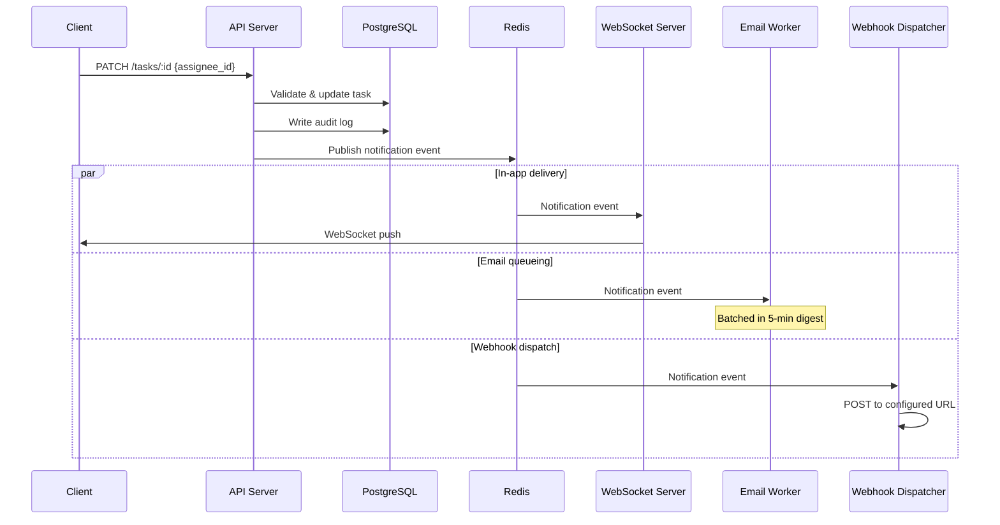

# Task Assignment Notification Flow

What happens when a task is assigned to someone — from the assignment action through notification delivery.

## Why This Matters

Assignments are how work gets distributed. If the assignee doesn't know, the task sits idle.

| Without notifications | With notifications |
|-----------------------|--------------------|
| Assignee checks manually | Assignee knows immediately |
| Tasks sit idle for hours/days | Work starts promptly |
| "I didn't know that was mine" | Clear accountability |

## Trigger

A user assigns a task to another user via the API (`PATCH /tasks/:id` with `assignee_id`).

## Stages

### 1. Assignment Validation
**Actor**: API Server
**Action**: Validates assignee is a project member with sufficient role
**Output**: Updated task record with new `assignee_id`
**Failure**: 403 if assignee lacks project access; 404 if user doesn't exist

### 2. Audit Log Entry
**Actor**: API Server
**Action**: Writes assignment change to `audit_log` table
**Output**: Audit record with previous and new assignee

```json
{
  "entity_type": "task",
  "entity_id": "task_abc123",
  "action": "assignment_changed",
  "actor_id": "user_456",
  "changes": {
    "assignee_id": {
      "from": null,
      "to": "user_789"
    }
  }
}
```

### 3. Notification Creation
**Actor**: Notification Service
**Action**: Creates notification record and resolves delivery channels
**Output**: Notification with delivery plan (in-app, email, webhook)

| Channel | Condition | Delivery |
|---------|-----------|----------|
| In-app | Always | Immediate via WebSocket |
| Email | User preference enabled | Batched in digest (5-min window) |
| Webhook | Project has webhook configured | POST to configured URL |

### 4. In-App Delivery
**Actor**: WebSocket Server
**Action**: Publishes notification to Redis pub/sub, delivered to connected clients
**Output**: Real-time notification in user's browser/app
**Failure**: If user not connected, notification waits in database; shown on next load

### 5. Email Digest
**Actor**: Email Worker (cron)
**Action**: Batches undelivered email notifications per user, sends digest
**Output**: Single email with all pending notifications from the window
**Failure**: If email service unavailable, retry next cycle; notifications marked `email_pending`

### 6. Webhook Delivery
**Actor**: Webhook Dispatcher
**Action**: POSTs event payload to project's configured webhook URL
**Output**: HTTP response from external system

```json
{
  "event": "task.assigned",
  "data": {
    "task_id": "task_abc123",
    "task_title": "Update login page",
    "assignee_id": "user_789",
    "assigned_by": "user_456",
    "project_id": "proj_xyz"
  }
}
```

## Termination

Flow completes when:
- Task record updated with new assignee
- Audit log entry written
- In-app notification delivered (or queued for offline user)
- Email notification queued for next digest batch
- Webhook dispatched (if configured)

## Flow Diagram



## Error Handling

| Error | Behaviour |
|-------|-----------|
| Assignee not a project member | 403 returned, no notification sent |
| Redis unavailable | Task updated in DB; notifications degraded (no real-time) |
| Email service down | Retry next digest cycle |
| Webhook endpoint returns 5xx | Retry 3x with exponential backoff, then log failure |
| Webhook endpoint returns 4xx | Log failure, no retry (client error) |

## Timing

| Phase | Duration |
|-------|----------|
| API validation + DB write | ~20ms |
| Redis publish | ~5ms |
| WebSocket delivery | ~50ms P99 |
| Email digest | Up to 5 minutes (batch window) |
| Webhook dispatch | Depends on external endpoint |

## Verification

| Environment | How |
|-------------|-----|
| **Local** | Assign a task via API. Check: DB updated, WebSocket message received, email job queued |
| **Automated tests** | Inject assignment event. Assert: audit log created, notification record exists, webhook payload matches schema |
| **Production** | `notifications.sent` counter by channel. Alert on delivery failure rate > 5%. Dead letter queue for failed webhooks |

**Local simulation:**

```bash
# Assign task and observe notification
curl -X PATCH http://localhost:3000/tasks/task_abc123 \
  -H "Authorization: Bearer $TOKEN" \
  -H "Content-Type: application/json" \
  -d '{"assignee_id": "user_789"}'

# Check WebSocket (in another terminal)
wscat -c ws://localhost:3000/ws -H "Authorization: Bearer $TOKEN"
# Should receive: {"type":"notification","event":"task.assigned",...}
```

## Related

- Permission model: `docs/permissions.md`
- WebSocket protocol: `docs/websocket.md`
- Webhook configuration: `docs/webhooks.md`
- Email digest worker: `src/workers/email-digest.ts`
